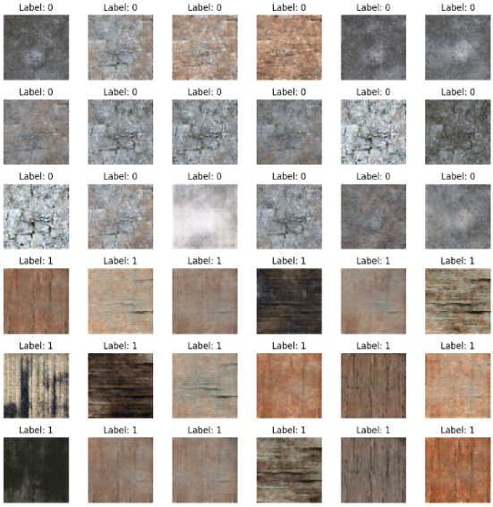
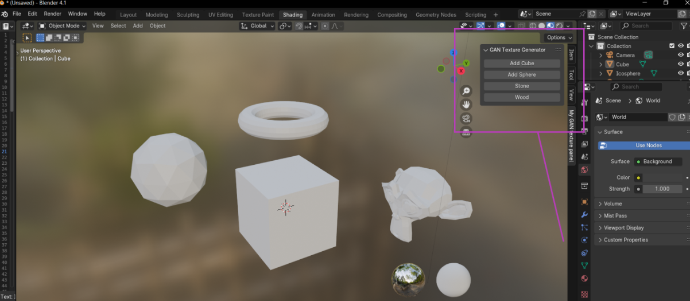
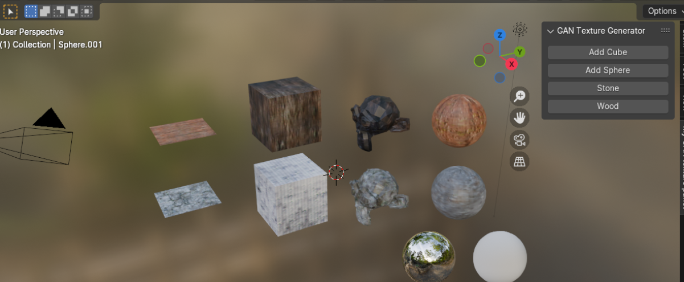

# Texture Generation with Conditional GANs (CGAN)

## Authors
- **Klaudia Jędryszczak** 
- **Anna Uchrońska** 


## Project Goal
The objective of this project was to develop a generic neural network model that, once trained, can generate new, non-existent textures. While initially designed for use in Blender, the model can be adapted for other software, including non-graphic programs, with appropriate adjustments.

## Introduction
The model presented here is a hybrid of **CGAN (Conditional Generative Adversarial Network)** and **DCGAN (Deep Convolutional Generative Adversarial Network)**. It combines elements from both architectures, where the generator leverages techniques from DCGAN, while the discriminator incorporates certain features of convolutional networks, though not fully compliant with DCGAN specifications.

### Key Concepts
- **GAN (Generative Adversarial Network)**: A neural network framework used in machine learning to generate new data that mimics the training data distribution. It comprises two primary components:
  - **Generator**: Generates data that tries to appear real.
  - **Discriminator**: Classifies data as real or fake.

- **CGAN (Conditional GAN)**: An extension of GAN that generates data based on an additional condition (e.g., a label). This allows CGANs to produce more specific outputs in line with the provided condition.

- **DCGAN (Deep Convolutional GAN)**: A modification of the standard GAN that uses deep convolutional networks in both the generator and discriminator, allowing better feature learning for image data.

## Training Data
The model was trained on a diverse set of images to generate varied textures. The training dataset consisted of images with two main categories:
- **Wood**
- **Stone**

### Data Loading and Preprocessing
The `load_and_slice_image` function prepares the images by slicing them into patches for training.

```python
def load_and_slice_image(image_path, slice_height, slice_width, num_slices, division=2):
    img = Image.open(image_path)
    width = img.width
    slices = []
    if width > 600:
        new_size = (max(img.width // division, slice_width), max(img.height // division, slice_height))
        img_resized = img.resize(new_size)
        img_width, img_height = img_resized.size
        if img_width >= slice_width and img_height >= slice_height:
            for _ in range(num_slices):
                x = np.random.randint(0, img_width - slice_width + 1)
                y = np.random.randint(0, img_height - slice_height + 1)
                img_slice = img_resized.crop((x, y, x + slice_width, y + slice_height))
                slices.append(img_slice)
        else:
            slices.append(img_resized)
    return slices
```

### Model Architecture
The implemented CGAN model is a combination of CGAN and DCGAN techniques, designed to generate realistic-looking textures that are difficult to distinguish from actual images.

#### Generator
The generator in this CGAN takes a noise vector and a category label as inputs, which are combined to produce synthetic images. It utilizes transposed convolutional layers to gradually scale up the noise vector to the target image size.

#### Discriminator
The discriminator is responsible for distinguishing between real and fake images. It takes the generated image and the category label as inputs and outputs a probability score indicating the likelihood of the image being real.

## Model Training
The model training involved many parameter configurations, and the training time often took several hours. The training process explored various settings and could likely achieve even better results by learning from a larger training dataset and with more iterations. Despite the limitations of the environment and hardware, very satisfactory results were obtained, as shown below.


## Blender 
To demonstrate that the model can be used in real situations, the graphics program Blender was utilized. After running the script, the user gains access to a sidebar in the 3D view, where they can easily generate and apply CGAN textures to objects. This constitutes a powerful tool for creating dynamic, realistic textures for 3D design, animation, or games, where rapid prototyping and high visual quality are essential.

Objects before generating textures:


Objects after generating textures:


## Requirements
The following Python packages are required: 
- `tensorflow`
- `numpy`
- `matplotlib`
- `Pillow`

Install the necessary packages using the following command:
```bash
pip install tensorflow numpy pillow matplotlib
```

### Usage 
1. **Load Data**: Load the training data using the `load_and_slice_image` function.
2. **Build and Compile Model**: Define and compile the CGAN model. 
3. **Train Model**: Train the CGAN model using the training data, using categories `wood` and `stone`.
4. **Generate Textures**: Generate new textures using the trained model.

### File Descriptions
- `cGAN.ipynb`:  This Jupyter Notebook contains the main code for building, training, and evaluating the CGAN model. It includes data loading, model architecture definition, and training loops.
- `blender_gan.ipynb`: This Jupyter Notebook contains scripts for integrating the trained CGAN model with Blender. It includes functions for:
  - generate_texture(label): Loads the trained generator model, generates a texture based on the input label (0 for stone, 1 for wood), and saves the generated texture as an image.
- `CGEN.h5`: This is the trained model file of the generator in HDF5 format. It can be loaded to generate textures without the need for retraining the model.
